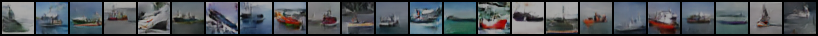
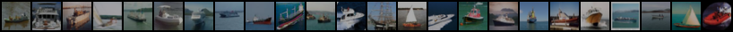
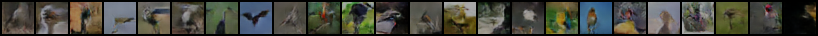

# Image-to-image domain translation using TraVeLGAN

PyTorch implementation of [TraVeLGAN: Image-to-image Translation by Transformation Vector Learning](https://arxiv.org/abs/1902.09631).

Add configuration file and run with :

```
python train.py --hparams=config_file --log=/runs/exp --device={0,1,..}
```

You can run the training of TraVeLGAN between two classes of CIFAR10 dataset using the ```cifar.json``` file. Download the dataset into the ```data``` folder and run the command above.

Here is an example with bird-ship translation after 500 epochs.






